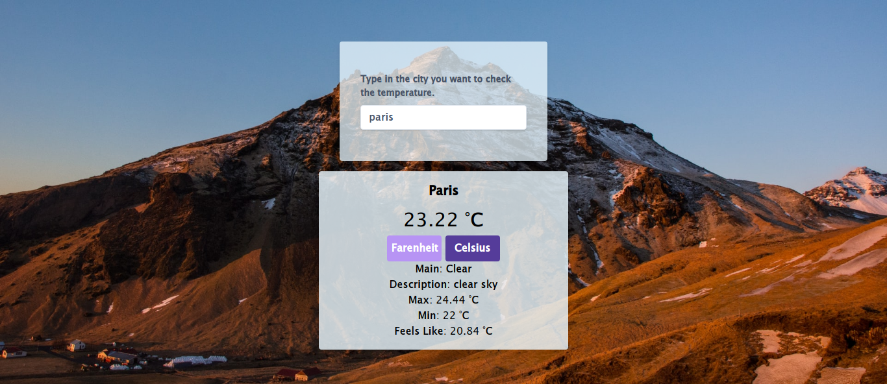

# Project Weather App - Javascript

This website was built to try out some external API's together with asynchronous programming. When you first open, it asks you to track your location. If you accept, will show the weather in the place you are. If not, will open a search form where you can search for the weather in a city you desire.

### Screenshots

- 

### FEATURES

Fluid background (depending on the weather), weather API and geolocation API.

### BUILT WITH

- HTML
- CSS
- Javascript
- Webpacker
- TailwindCSS

### LIVE VERSION

- [GitHack](https://raw.githack.com/expjazz/weather_app/featureV1/dist/index.html)

### Getting Started

- Clone the project to your local machine;
- `cd` into the project directory;
- Run `npm install` to install the necessary modules;
- To check in development mode, run `npm start`, the page will automatically load on [localhost:8080](localhost:8080).
- To see in procution mode, run `npm run build`, open the `dist` folder and finally the `index.html`.

### AUTHORS

👤Expedito Andrade

- Github: [@githubexpjazz](https://github.com/expjazz)
- Twitter: [@expjazz](https://twitter.com/expeditoandrade13)
- Linkedin: [Expedito Andrade](https://www.linkedin.com/in/expedito-andrade/)
- Portfolio: [Expedito Andrade](https://expjazz.github.io/expedito_andrade/)

### Show your support

Give a star if you like this project!

### Acknowledgments

- Microverse

### 🤝 Contributing

Contributions, issues and feature requests are welcome! Start by:

- Forking the project
- Cloning the project to your local machine
- `cd` into the project directory
- Run `git checkout -b your-branch-name`
- Make your contributions
- Push your branch up to your forked repository
- Open a Pull Request with a detailed description to the development branch of the original project for a review

### Show your support

Give a ⭐️ if you like this project!

### 📝 License

This project is MIT licensed
